# minor-browser-technologies
Assignments for the course Browser Technologies

# week 1
## assignment 1.2 (fork je funda)
Link to my Funda app: <a href="https://github.com/lhafkamp/minor-funda">https://github.com/lhafkamp/minor-funda</a>

#### 1. Images
My app is really fast since all my images are SVG's:
 
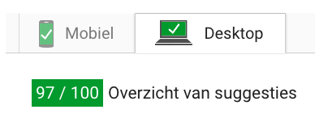
 
However some old browsers don't support using SVG's. Here I tried loading the website using IE8 on Windows 7 and you can see that the SVG doesn't load.
 
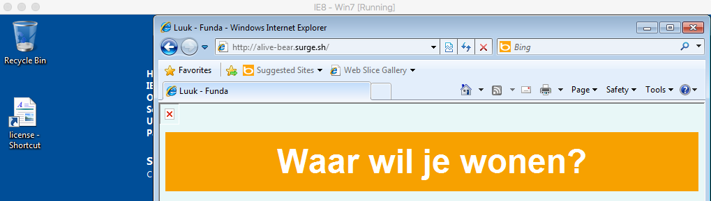
 
 A solution for this problem is to use the <a href="https://developer.mozilla.org/en-US/docs/Mozilla/Tech/XUL/Attribute/onerror">onerror event</a>. With this you can set an alternative image for when the first image doesn't load properly.

On <a href="funda.nl">funda.nl</a> you can see how they implemented the onerror event:
 

#### 2. Custom fonts
Didn't use

#### 3. Javascript
I tested my app on an iPhone 4 and a tablet which gave the following results:

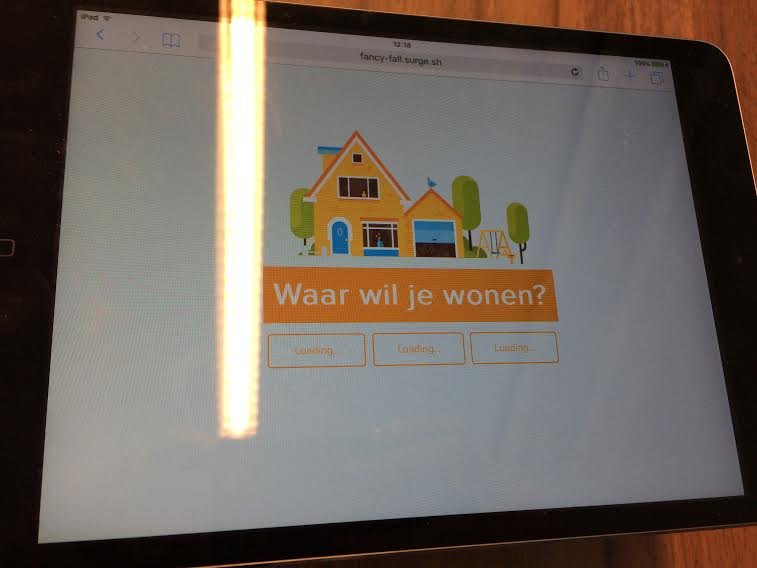

On the tablet it wouldn't get past its 'loading' phase. This problem occurs because I used navigation.currentLocation which is a native API that asks you for your location. This doesn't work because it needs a https server and its currently running on a http server. For certain devices you also have to enable a flag to allow the device to ask for your location.

<b>How do I solve this?</b>
So for the first problem I have to use a https server but I also have to create a fallback for when it doesn't load. Its a bit hard to call the loading problem 'broken' because its just waiting for the user to confirm. To start out I could fill the <buttons>buttons</buttons> with 3 standard options and inject the loading text with innerHTML. After that I could create a script that replaces the loading options with 3 standard options if the loading takes to long (lets say 10 seconds).

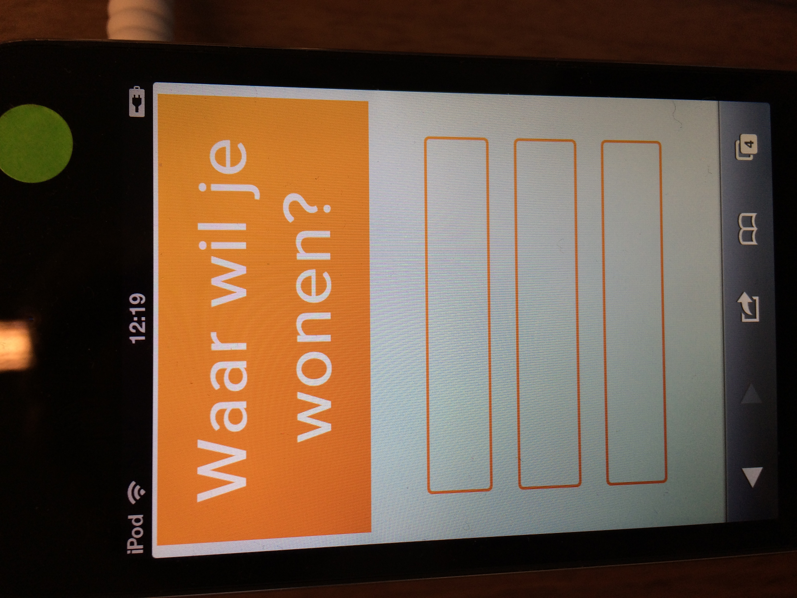

On the iPhone 4 it doesn't even start loading. This is because I am using <a href="https://developer.mozilla.org/en-US/docs/Web/API/Fetch_API">fetch</a> to acces the Funda API.

<b>How do I solve this?</b>
In order for fetch to work on a mobile phone I eather have to manually do a xhttp request without fetch or I have to use a polyfill called <a href="https://github.com/github/fetch">window.fetch</a>.

Another problem is that I'm using template literals to render HTML with Javascript. This should be rendered server side instead of in the client.

#### 4. Colors
 
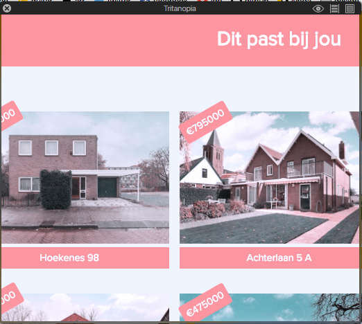
 
 
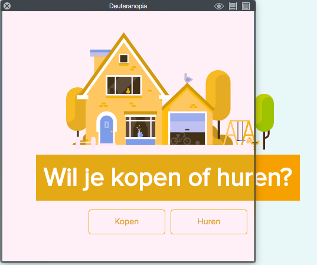

There is plenty of contrast when it comes to hover/focus states. There are also no conflicts when I'm using Sim Daltonism to check if my site is accessible for the color blind.

#### 5. Broadband internet
If I use my app on 2G I get the following notice:

 
This is not necessarily a bad thing. In order to gain more control over this I could use <a href="fontfaceobserver.com">font face observer</a> to create my own fallback fonts when the first font cant't load properly.

#### 6. Cookies
Didn't use

#### 7. localStorage
Didn't use

#### 8. Mouse/Trackpad 
Everything works fine until you actually get the results. In order to fix this I simply have to put focus states on the 
's that I'm rendering from my Javascript.

## assignment 1.1

### feature: colors
#### Problems:
Website colors can be all fun and dandy for someone who has optimal vision. However, if the user is color blind some problems might occur.

Its important to keep these color ratio's in mind because according to
<a href="http://www.colourblindawareness.org/colour-blindness/">http://www.colourblindawareness.org/colour-blindness/</a> 1 in 12 men have some form of color blindness. This is a huge part of your userbase that you don't want to lose.

Its also important to keep hover/focus states in mind. A user expects a hover/focus to look different enough for them to understand what is going on. The user could think the site is broken and leave.

#### How can you test this?
The application 'Sim Daltonism' boots a window that simulates different forms of color blindness.

#### Where does this go wrong?
On http://www.greenpeace.nl/: 
 
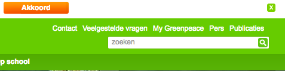
 
 
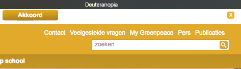
 
Here you can see that the 'Akkoord' button suddenly becomes less visible.

 
On http://www.kerststadvalkenburg.nl/en/activities-christmas-town-valkenburg/:
 
 
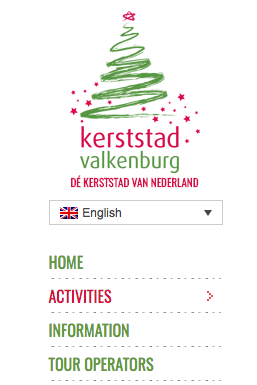
 
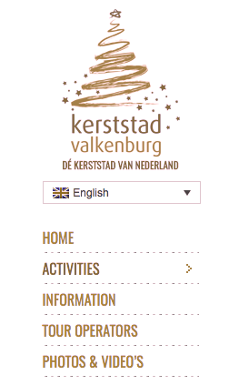
 
The active button isn't very clear

 
On http://www.lospilones.com/nl/:
 

 

 
You can't tell if NL is the one that is active

#### How can you fix this?
Make sure colors have the right contract ratio. A great way to test the color ratio is on <a href="http://leaverou.github.io/contrast-ratio/">http://leaverou.github.io/contrast-ratio/</a>.

### feature: custom fonts
#### Problems:
The custom font doesn't load, this can be problematic if you use something like icon-fonst which need a key placeholder. You can suddenly have a 'k' or '2' next to your form, this could confuse or missguide the user.

I also found a problem on <a href="http://stackoverflow.com/questions/15993682/custom-font-rendering-problems">http://stackoverflow.com/questions/15993682/custom-font-rendering-problems</a> that states that certain types of custom fonts will break once you set font-weight. This problem occurs in IE and Firefox.

On the site <a href="https://www.filamentgroup.com/lab/font-loading.html">https://www.filamentgroup.com/lab/font-loading.html</a> they mention that using cookies is the way to go if you want to set a custom fonts in order to create a fallback. From personal experience I think Font Face Observer is the correct way to go.

#### How can you test this?
In Firefox: 
 - type in about:config
 - search for gfx.downloadable_fonts.enabled
 - double click to disable custom fonts

#### Where does this go wrong?
In my own site I used custom fonts:

 
As you can see it looks like garbage once you remove custom fonts.

On http://fontastic.me/
 
 
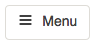
 

 
Doesn't really look like a menu icon anymore
 
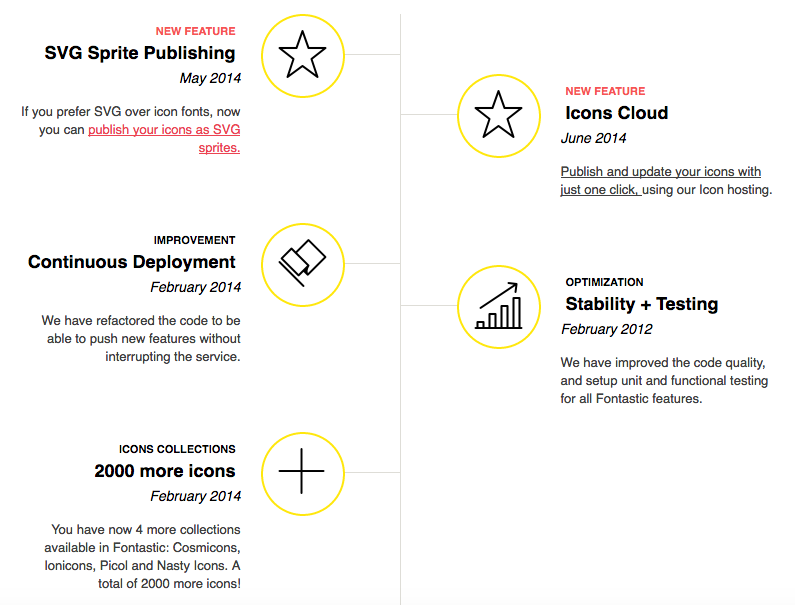
 
 
 
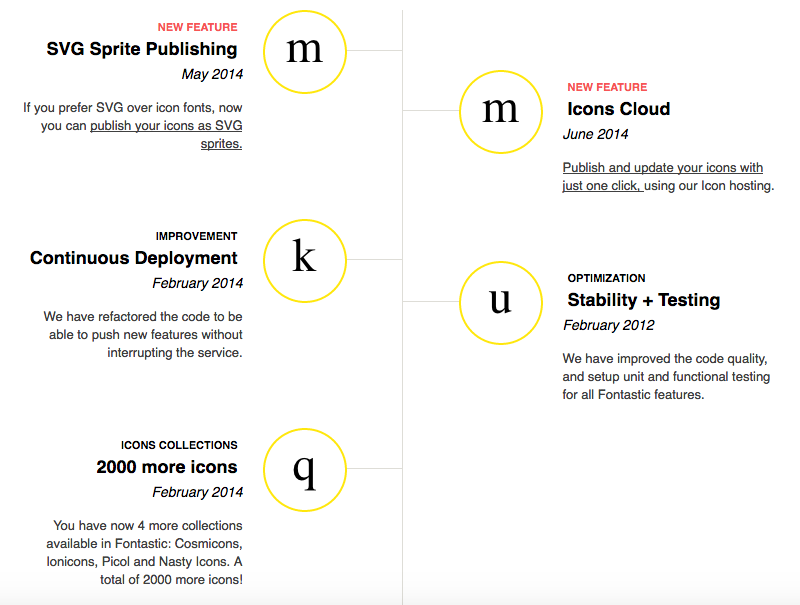

#### How can you fix this?
Create a fallback for your fonts with <a href="https://fontfaceobserver.com/">https://fontfaceobserver.com/</a>. This way you can choose what happends to your fonts when your custom-font doesn't load. And don't use icon-fonts, use SVG's.

