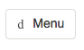

# minor-browser-technologies
Assignments for the course Browser Technologies

# week 1
## assignment 1.1

### feature: colors
#### Problems:
Website colors can be all fun and dandy for someone who has optimal vision. However, if the user is color blind some problems might occur.

Its important to keep these color ratio's in mind because according to
<a href="http://www.colourblindawareness.org/colour-blindness/">http://www.colourblindawareness.org/colour-blindness/</a> 1 in 12 men have some form of color blindness. This is a huge part of your userbase that you don't want to lose.

#### How can you test this?
The application 'Sim Daltonism' boots a window that simulates different forms of color blindness.

#### Where does this go wrong?
On http://www.greenpeace.nl/: 
 

 

 
Here you can see that the 'Akkoord' button suddenly becomes less visible.

 
On http://www.kerststadvalkenburg.nl/en/activities-christmas-town-valkenburg/:
 

 

 
The active button isn't very clear

 
On http://www.lospilones.com/nl/:
 

 

 
You can't tell if NL is the one that is active

#### How can you fix this?
Make sure colors have the right contract ratio. A great way to test the color ratio is on <a href="http://leaverou.github.io/contrast-ratio/">http://leaverou.github.io/contrast-ratio/</a>.

### feature: custom-fonts
#### Problems:
The custom-font doesn't load, this can be problematic if you use something like icon-fonst which need a key placeholder. You can suddenly have a 'k' or '2' next to your form, this could confuse or missguide the user.

#### How can you test this?
In Firefox: 
 - type in about:config
 - search for gfx.downloadable_fonts.enabled
 - double click to disable custom fonts

#### Where does this go wrong?
In my own site I used custom fonts:

 
As you can see it looks like garbage once you remove custom fonts.

On http://fontastic.me/
 

 

 
Doesn't really look like a menu icon anymore
 

 

#### How can you fix this?
Create a fallback for your fonts with <a href="https://fontfaceobserver.com/">https://fontfaceobserver.com/</a>. This way you can choose what happends to your fonts when your custom-font doesn't load. And don't use icon-fonts, use SVG's.

