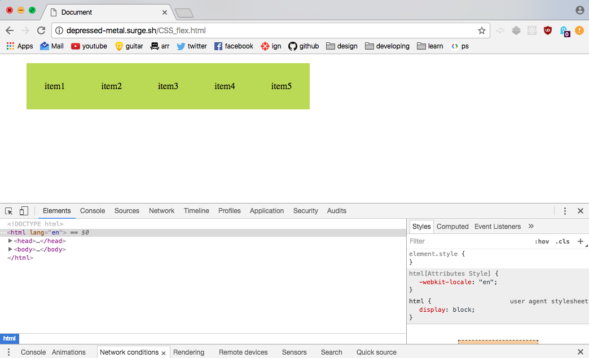

# Week 2

Link: <a href="http://luukhafkamp.nl/bt/">http://luukhafkamp.nl/bt/</a>

## 1. flex + @supports (CSS)

#### description:
Display: flex; doesn't work everywhere. With the @supports tag it will only use flexbox once the browser can actually support it. In this case it renders display: inline-block; once it doesn't.

#### sources:
http://caniuse.com/#search=flex  
https://davidwalsh.name/css-supports  

#### tested in:
  

Chrome - Flex is used
  

  

IE8 - Flex isn't used
  

  

Windows phone (device lab) - Flex is used
  

## 2. viewport units (CSS)

#### description:
Even viewport units don't work everywhere. You can create a fallback by adding a width on top of the viewport width.

#### sources:
http://caniuse.com/#search=viewport%20units  
https://github.com/alvarotrigo/fullPage.js/issues/854  

#### tested in:
  

Chrome - viewport is used
  

  

IE8 - shows nothing
  

  

IE8 retry - shows the fallback, it didn't show anything because I used a nav tag. The more you know.
  

  

Windows phone (device lab) - viewport is used
  

## 3. svg (HTML)

#### description:
This code makes sure that if the browser can't load the svg file, it will load the fallback with onerror="this.src='images/html-5.png'"

#### sources:
http://caniuse.com/#search=svg  
https://css-tricks.com/svg-fallbacks/  
https://www.voorhoede.nl/  

#### tested in:
  

Chrome - renders the svg
  

  

IE8 - renders the png (you can tell by the resolution)
  

  

Windows phone (device lab) - renders the svg
  

## 4. intrinsic sizing (CSS)

#### description:
Intrinsic sizing wraps the width around the minimum content. While I didn't find a way to wrap the width around the content with a fallback I did create a fallback for if it doesn't work.

#### sources:
http://caniuse.com/#search=max-content  
http://stackoverflow.com/questions/22834379/css3-ms-max-content-in-ie11  

#### tested in:
  

Chrome - min-content works
  

  

IE8 - min-content doesn't work, goes to the 100% width fallback
  
  
  

Windows phone (device lab) - min-content doesn't work, goes to the 100% width fallback
  
  

## 5. css3colors (CSS)

#### description:
CSS3 Colors don't work in IE8-. I created a simple hex fallback so that it does work.

#### sources:
http://html5please.com/  
http://caniuse.com/#search=CSS3%20Colors  
https://github.com/CSSLint/csslint/wiki/Require-fallback-colors  

#### tested in:
  

Chrome - uses rgba
  

  

IE8 - uses the hex fallback
  

  

Windows phone (device lab) - uses rgba
  

## 6. details (HTML)

#### description:
De details tag will hide inside a summary tag so that you can click it open. I researched what would happen if the browser doesn't support it and it turns out that it doesn't really need a fallback since it will 'unhide' the content once the browser doesn't.

#### sources:
http://caniuse.com/#search=details  
https://html.spec.whatwg.org/multipage/forms.html#the-details-element  

#### tested in:
  

Chrome - the detail tag is hidden
  

  

IE8 - the detail tag doesn't work and it shows all the content normally
  

  

Windows phone (device lab) - the detail tag doesn't work and it shows all the content normally
  

## 7. Array.from (JS)

#### description:
A NodeList isn't always what you want because you can't use cool stuff like .map on it. The way to conver it to an array is using Array.from in ES6. However, not every browser supports ES6 so with the following script you can convert the NodeList into an array without using ES6.

#### sources:
http://kangax.github.io/compat-table/es6/#test-Array.from  
http://stackoverflow.com/questions/3199588/fastest-way-to-convert-javascript-nodelist-to-array

#### tested in:
  

Chrome (console)
  

## 8. Smooth scrolling (JS)

#### description:
A smooth scrolling script is nice but not every browser supports this kind of behaviour + without Javascript you still want your page to go from one place to another. Using #id creates a fallback that lets you do that and if your browser is cool enough, you also get the animation.

#### sources:
https://stackoverflow.com/questions/10063380/javascript-smooth-scroll-without-the-use-of-jquery

#### tested in:
  

Chrome - gets the animation
  

  

IE8 - not showing footer at the bottom 

  

IE8 - works without an animation, changed the footer tag to a div tag
  
