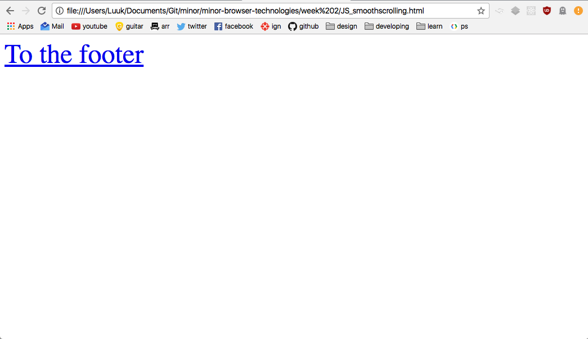

# Week 2

## 1. flex + @supports (CSS)

#### sources:
http://caniuse.com/#search=flex
https://davidwalsh.name/css-supports
#### tested in:
  

Chrome
  

  

IE8
   

  

Windows phone (device lab)
  

## 2. viewport units (CSS)

#### sources:
http://caniuse.com/#search=viewport%20units
https://github.com/alvarotrigo/fullPage.js/issues/854

#### tested in:
  

Chrome
  

  

IE8
  

  

Windows phone (device lab)
  

## 3. svg (HTML)

#### sources:
http://caniuse.com/#search=svg
https://css-tricks.com/svg-fallbacks/

#### tested in:
  

Chrome
  

  

IE8
  

  

Windows phone (device lab)
  

## 4. intrinsic sizing (CSS)

#### sources:
http://caniuse.com/#search=max-content
http://stackoverflow.com/questions/22834379/css3-ms-max-content-in-ie11

#### tested in:
  

Chrome
  

  

IE8
  
  
  

Windows phone (device lab)
  
  

## 5. css3colors (CSS)

#### sources:
http://html5please.com/
http://caniuse.com/#search=CSS3%20Colors
https://github.com/CSSLint/csslint/wiki/Require-fallback-colors

#### tested in:
  

Chrome
  

  

IE8
  

  

Windows phone (device lab)
  

## 6. details (HTML)

#### sources:
http://caniuse.com/#search=details
https://html.spec.whatwg.org/multipage/forms.html#the-details-element

#### tested in:
  

Chrome
  

  

IE8
  

  

Windows phone (device lab)
  

## 7. Array.from (JS)

#### sources:
http://kangax.github.io/compat-table/es6/#test-Array.from
http://stackoverflow.com/questions/3199588/fastest-way-to-convert-javascript-nodelist-to-array

#### tested in:
  

Chrome (console)
  

## 8. Smooth scrolling (JS)

#### sources:
https://stackoverflow.com/questions/10063380/javascript-smooth-scroll-without-the-use-of-jquery

#### tested in:
  

Chrome
  

  

IE8
  

  

Windows phone (device lab)
  

