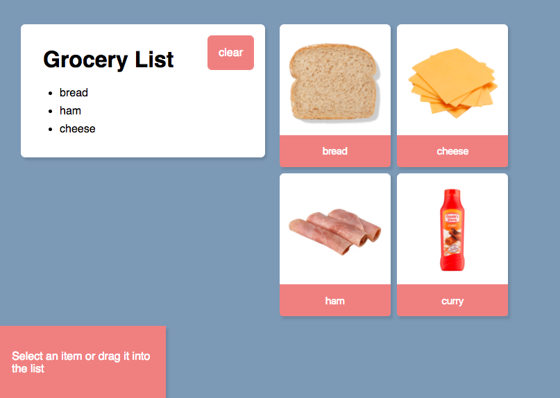
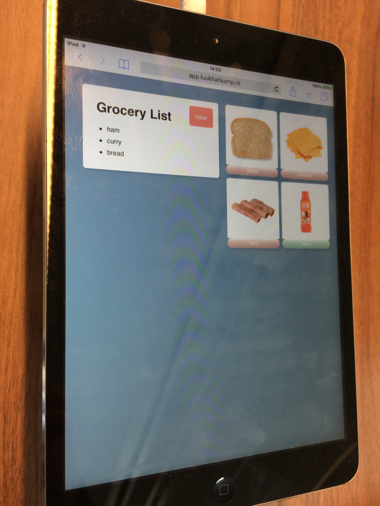
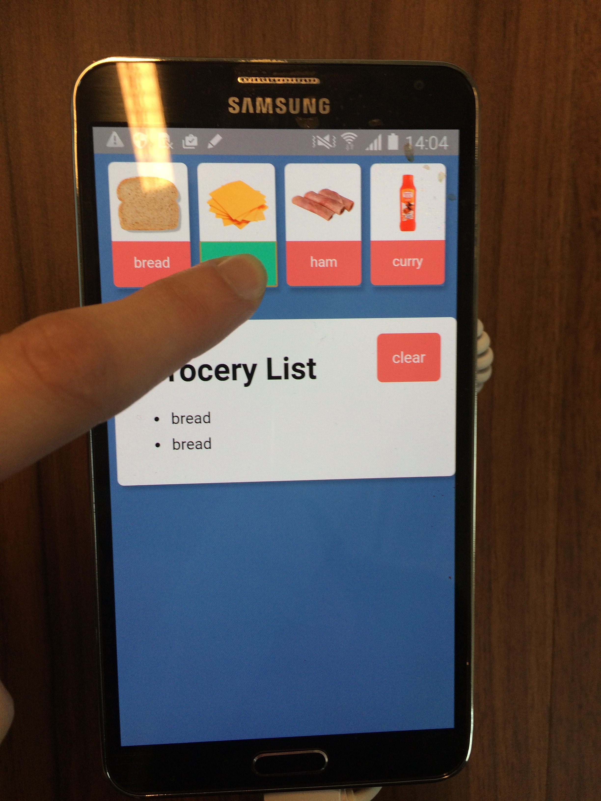
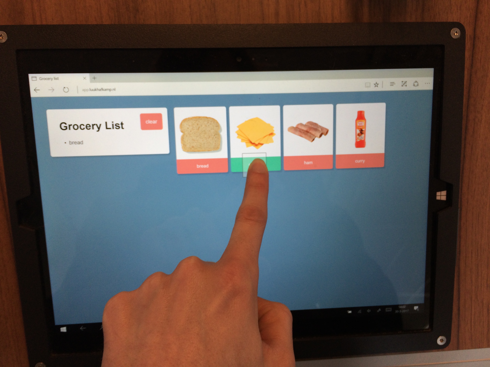
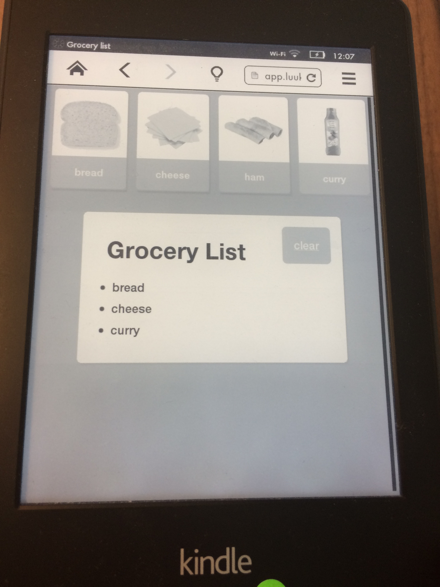
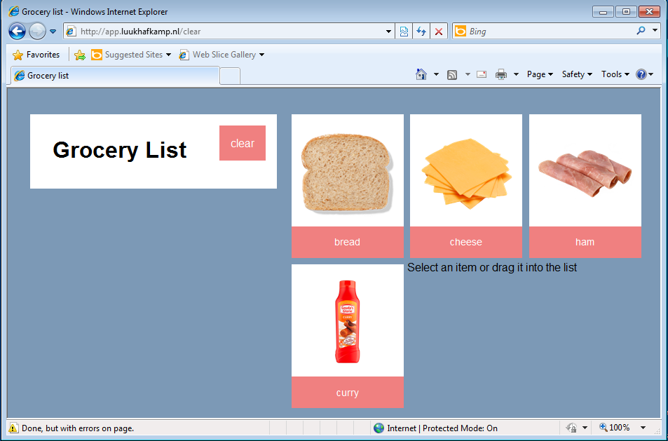
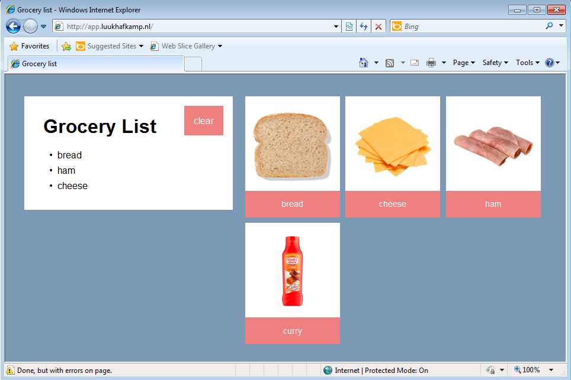

# Grocery list
Assignment to make a grocery list that works on every browser.

## Core functionality
The core functionality is adding ingredients to your grocery list. This can be done by drag and dropping the ingredients into the list. Since this won't work in every browser you can also click on the buttons to add them.

## Build
To use the app run `npm install` and then `npm start` to start the server on port `3001`.

## Compatibility

### Progressive enhancement and fallbacks
I build this app from a progressive enchancement perspective. The site works fine with only html due a post request created with the submit buttons (which are the ingredients that you can add). If you have a browser that does support drag and drop the drop triggers a click() function on the submit button so you get the same effect but with a better user experience.

If your browser doesn't support drag and drop or 'classList' the message that tells you you can use this functionality will dissapear in order not to confuse the user. This is done with the following feature detection:

`if ('classList' in document.documentElement  || 'draggable' in document.createElement('span')) {
	footer.classList.remove('hide');  
}`

Another tiny fallback is done with the cursor style:  
`cursor: -webkit-grab;`  
`cursor: -moz-grab;`  
`cursor: move;`  
  
The grab cursor isn't widely supported so it will use the less charming move cursor if the browser doesn't support grab.

### Modern browsers
[x] Chrome  
[x] Firefox  
[x] Safari - no drag and drop  

### Device lab
iPad  
  
Samsung  
  
Windows tablet  
  
Kindle e-reader  
  
  
All the devices that I tested on did not support the drag and drop functionality however they still worked fine with the button fallback.

### IE8
  
At first the 'Select an item or drag it into the list' message would'nt hide properly because IE8 doesn't support 'classList'. The core functionality did work however.

  
I did manage to solve this by creating the feature detection stated above.

## Sources
<a href="https://developer.mozilla.org/en-US/docs/Learn/Tools_and_testing/Cross_browser_testing/Feature_detection">https://developer.mozilla.org/en-US/docs/Learn/Tools_and_testing/Cross_browser_testing/Feature_detection</a>  
<a href="https://plainjs.com/javascript/attributes/adding-removing-and-testing-for-classes-9/">http://caniuse.com/</a>  
<a href="https://plainjs.com/javascript/attributes/adding-removing-and-testing-for-classes-9/">https://plainjs.com/javascript/attributes/adding-removing-and-testing-for-classes-9/</a>  
<a href="http://diveintohtml5.info/everything.html">http://diveintohtml5.info/everything.html</a>